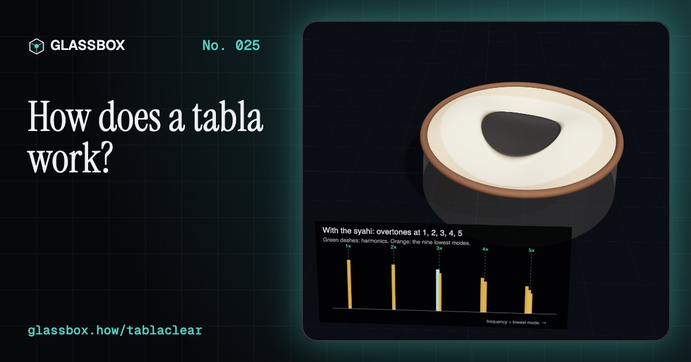
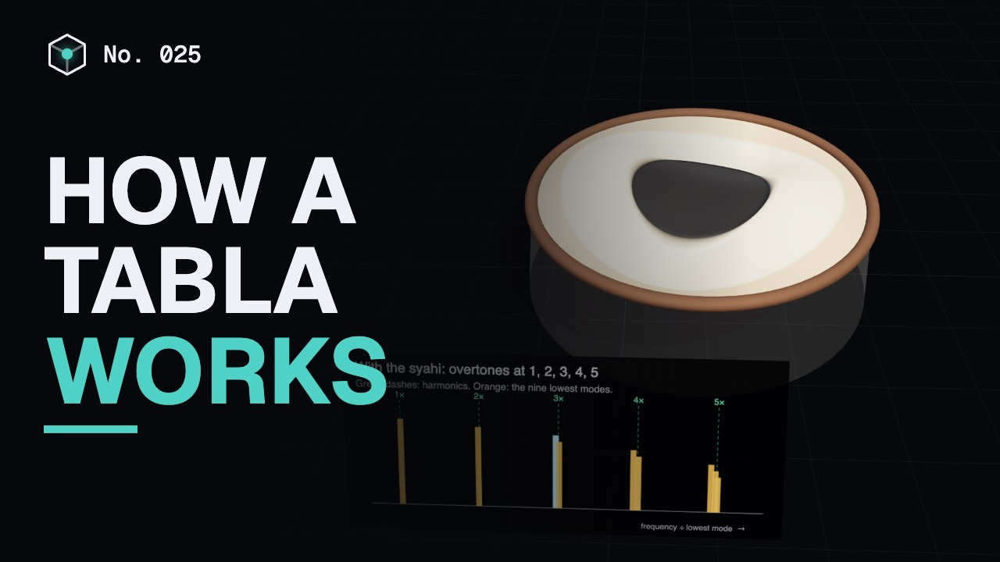
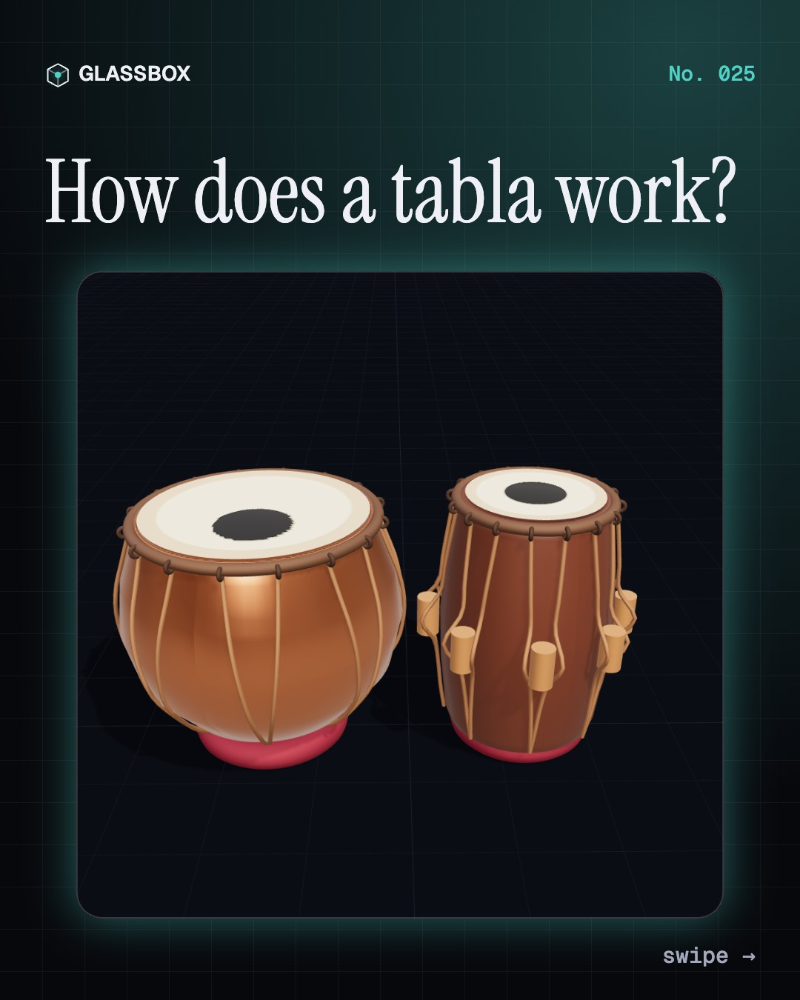
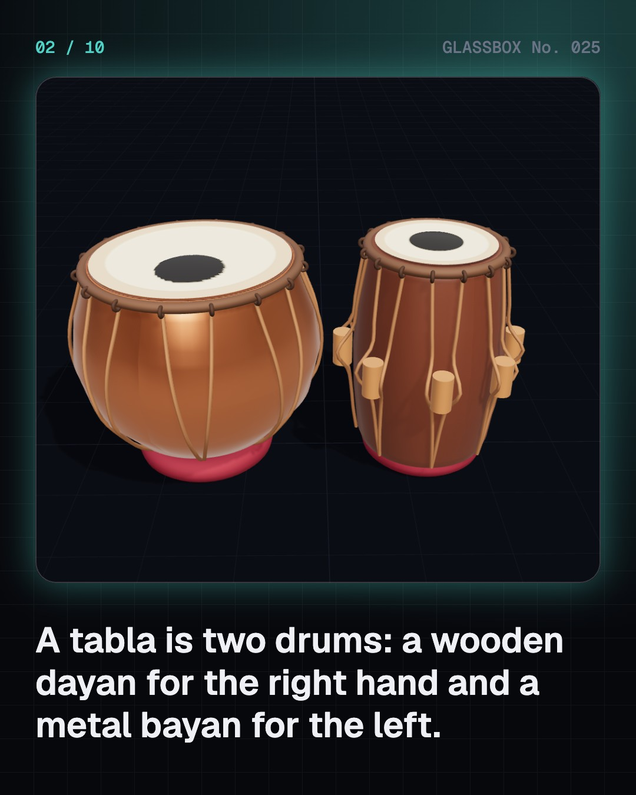
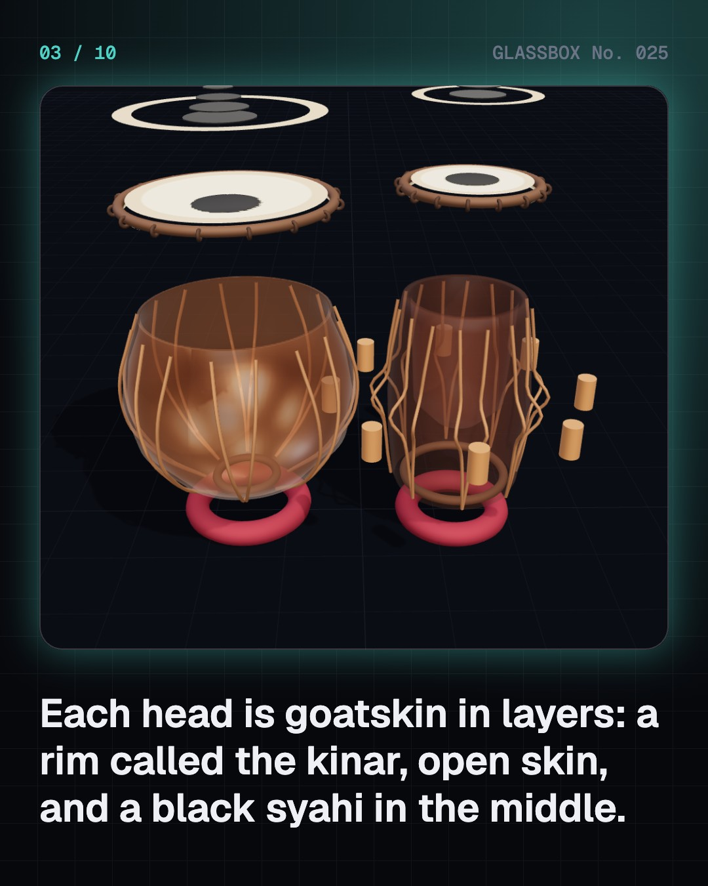
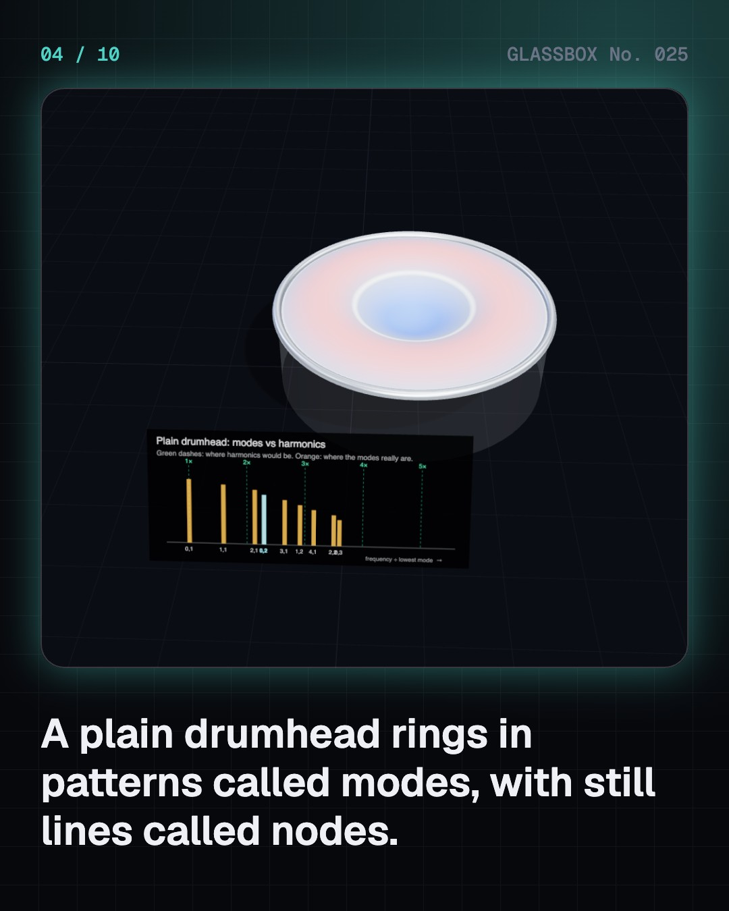

<!-- glassbox:start -->
<!-- Generated from glassbox.json by the Glassbox hub (npm run readme -- tablaclear). Edit glassbox.json, not this block. -->
<p align="center"><a href="https://glassbox-production-fd52.up.railway.app/e/tablaclear/"></a></p>

<h1 align="center">TablaClear</h1>

<p align="center"><b>How does a tabla work?</b><br>Most drums just go thud. The tabla sings a note you can tune to a song, thanks to a black spot of iron-filing paste that C. V. Raman explained in 1920. Play the dayan and bayan in 3D, watch the drumhead's modes line up, and bend the bass with your palm.</p>

<p align="center"><a href="https://glassbox-production-fd52.up.railway.app/tablaclear/"><b>▶ Play with it</b></a> &nbsp;·&nbsp; <a href="https://glassbox-production-fd52.up.railway.app/e/tablaclear/">Read the 60-second explainer</a> &nbsp;·&nbsp; <a href="https://glassbox-production-fd52.up.railway.app/tablaclear/glassbox/reel.mp4">Watch the 40-second video</a></p>

<p align="center">
  <a href="https://glassbox-production-fd52.up.railway.app/e/tablaclear/"></a>
  <a href="https://glassbox-production-fd52.up.railway.app/e/tablaclear/"></a>
  <a href="LICENSE"></a>
  <a href="LICENSE-CONTENT.md"></a>
  <a href="#privacy"></a>
</p>

## In 60 seconds

1. **Two drums, one instrument.** The dayan is a hollowed block of sheesham wood played with the right hand; the bayan is a copper or brass bowl for the left. Each has a goatskin head, the pudi, with an outer ring (kinar), open skin (maidan) and a black spot (syahi), laced on by a braided gajra and leather straps with wooden gatta blocks.
2. **A plain drumhead thuds.** A stretched round skin rings in patterns called modes, with still nodal lines and circles. Their frequencies follow the zeros of Bessel functions, 1 : 1.59 : 2.14 : 2.30 : 2.65, which are not whole-number multiples. With no harmonic series, the ear hears a thud, not a note.
3. **Raman's black spot.** The syahi is many thin layers of paste made with iron filings, soot, rice and gum, heaviest at the centre. In 1920 C. V. Raman and Sivakali Kumar showed that this loading pulls the first nine modes into five groups at 1 : 2 : 3 : 4 : 5. That harmonic series is why the dayan has a pitch.
4. **Where you strike picks the sound.** Na strikes the rim while the ring finger rests on the syahi's edge; the round modes are damped and bright harmonics ring. Tun strikes the centre, where only round modes move, for a deep tone. Ge is the bayan's open boom, ke its flat slap, and dha is na and ge together.
5. **The bayan bends.** Pressing the heel of the palm into the bayan stretches its skin. The frequency grows with the square root of tension, f ∝ √T, so the boom glides up as the palm slides forward: the gamak that makes the tabla talk.
6. **Tuned to Sa, keeping time.** Hammering the gattas down tightens the straps; tapping the gajra fine-tunes by a few cents, until the dayan rings at the song's Sa. Then the theka keeps the cycle: teentaal's 16 beats, with claps on 1, 5 and 13 and the bass falling silent at khali, beat 9.

## Words worth knowing

| Term | Meaning |
|---|---|
| **Dayan and bayan** | The right-hand wooden drum with a clear pitch, and the left-hand metal bass drum. |
| **Syahi** | The black spot on the head: layers of paste with iron filings that load the centre of the skin. |
| **Mode** | One pattern a drumhead can vibrate in, with its own frequency and still nodal lines. |
| **Bessel function** | The curve that describes how a round skin bends; its zeros set a plain drumhead's mode frequencies. |
| **Harmonic series** | Overtones at 2, 3, 4, 5 times the lowest frequency, which our ears hear as one clear note. |
| **Bol** | A spoken syllable for a tabla stroke, like na, tin, tun, ge, ke or dha. |
| **f ∝ √T** | A stretched skin's frequency grows with the square root of its tension. |
| **Gatta and gajra** | The wooden tuning blocks under the straps, and the braided rim that is tapped to fine-tune. |
| **Teentaal** | A 16-beat rhythmic cycle in four sections, with a khali (empty) section where the bayan rests. |

## A short history

**About 2,000 years from drums made with river clay in an ancient Sanskrit text to a pair of small drums heard on Grammy stages, film soundtracks and drum machines.**

- **1** · An ancient recipe for drums (Attributed to the sage Bharata, India)
- **1300** · A famous legend with no evidence (Attributed to Amir Khusrau, Delhi Sultanate)
- **1720** · The first tabla school (Sidhar Khan Dhadi (attributed founder), Delhi)
- **1745** · The tabla appears in paintings (Indian court painters, North India)
- **1797** · Seven nights for the Nawab (Pandit Ram Sahai (1780–1826), Lucknow and Benares (Varanasi))
- **1920** · Raman hears harmonics in a drum (C. V. Raman and Sivakali Kumar, Calcutta (Kolkata))
- **1954** · The maths of a loaded drumhead (B. S. Ramakrishna and M. M. Sondhi, Indian Institute of Science, Bangalore)
- **1967** · A tabla solo at a rock festival (Ustad Alla Rakha with Ravi Shankar, Monterey, California)

The full story, with 30 moments, charts, people and 47 sources: [glassbox.how/e/tablaclear/history](https://glassbox-production-fd52.up.railway.app/e/tablaclear/history/). The data lives in [`history.json`](history.json).

## Video and slides

Made with the Glassbox studio from this box's storyboard (`window.glassbox.director`). Free to reuse under CC BY 4.0.

<a href="https://glassbox-production-fd52.up.railway.app/tablaclear/glassbox/video.mp4"></a>

<p><a href="glassbox/slide-1.jpg"></a> <a href="glassbox/slide-2.jpg"></a> <a href="glassbox/slide-3.jpg"></a> <a href="glassbox/slide-4.jpg"></a></p>

| File | What | Size |
|---|---|---|
| [`glassbox/reel.mp4`](https://glassbox-production-fd52.up.railway.app/tablaclear/glassbox/reel.mp4) | Reel / Short, with captions and soundtrack | 1080×1920 |
| [`glassbox/video.mp4`](https://glassbox-production-fd52.up.railway.app/tablaclear/glassbox/video.mp4) | YouTube video, with captions and soundtrack | 1920×1080 |
| `glassbox/slide-1…10.jpg` | Instagram carousel | 1080×1350 |
| `glassbox/thumb.jpg` | YouTube thumbnail | 1280×720 |
| `glassbox/cover.jpg` | Share card and repo social preview | 1200×630 |
| [`glassbox/history-reel.mp4`](https://glassbox-production-fd52.up.railway.app/tablaclear/glassbox/history-reel.mp4) | “History in 10 moments” Reel / Short | 1080×1920 |
| `glassbox/history-slide-*.jpg` | History carousel | 1080×1350 |
| `glassbox/post.json` | Post copy and schedule used by the publish kit | |

## Privacy

This box has no accounts and no ads, and it ships its own fonts and libraries. When you run it yourself it sends nothing anywhere. On glassbox.how, the site's `/bar.js` also loads Glassbox's analytics: **Google Analytics** to count visits (it asks first in the EU, UK and Switzerland, and stays off when your browser sends Global Privacy Control or Do Not Track) and **ClickTrust** to detect bots.

It remembers a few things **in your own browser only**, and never sends them anywhere:

| Browser storage key | What it holds |
|---|---|
| `tablaclear.v1` | Which chapters you have opened, your best quiz scores, and sound on or off. |

Exactly what each one sees is at [glassbox.how/privacy](https://glassbox-production-fd52.up.railway.app/privacy/).

## Licences

- **Code:** [MIT](LICENSE). Use it, change it, ship it.
- **Explanations, text, images and videos** (`glassbox.json`, `glassbox/`): [CC BY 4.0](LICENSE-CONTENT.md). Credit “Glassbox, glassbox.how/e/tablaclear”.
- **Third-party parts** keep their own licences: [three.js](https://threejs.org) (MIT), [Geist, Instrument Serif](https://openfontlicense.org) (SIL OFL 1.1).
- The Glassbox name and logo aren't covered by either licence. See the [terms](https://glassbox-production-fd52.up.railway.app/terms/).

Found a mistake? [Open an issue](https://github.com/bdeeps/tablaclear/issues). Corrections happen in public.
<!-- glassbox:end -->

## Run it

It's plain HTML, CSS and JavaScript. No build step and no dependencies. Run locally, it contacts no other website.

```bash
python3 -m http.server 8000
```

Three.js and the fonts ship in `vendor/` and `fonts/`, so it also works offline.

Then open http://localhost:8000.

## How it's built

| File | What |
|---|---|
| `index.html`, `css/app.css` | The page and its styles |
| `js/app.js`, `js/stage.js`, `js/ui.js`, `js/kit.js` | The shared Glassbox 3D engine: chapters, 3D stage, controls, quiz, video director |
| `js/chapters/*.js` | One file per chapter: the 3D model, controls, text, key terms, quiz and video scenes |
| `js/tabla.js` | Drumhead modes (Bessel functions), Raman's near-harmonic loaded head, the bols, the WebAudio modal-synthesis drum voice, the teentaal theka, keyboard input and the 3D dayan and bayan |
| `glassbox.json` | Title, question, explainer beats, key terms, browser storage and credits shown on glassbox.how |
| `reel` in each chapter | The storyboard the Glassbox studio records into short videos |
| `glassbox/` | The published video, slides, thumbnail and post copy |
| `fonts/`, `vendor/three/` | Self-hosted Geist and Instrument Serif (SIL OFL 1.1) and three.js (MIT) |
